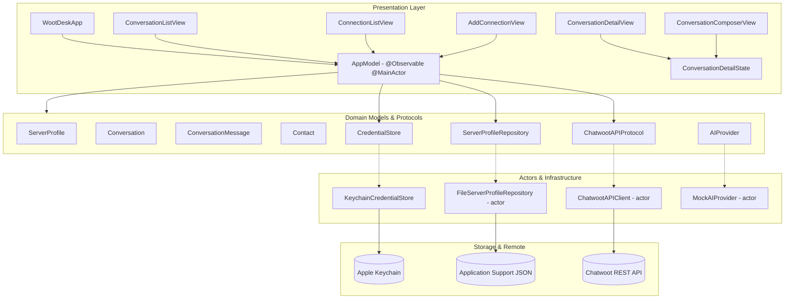

# WootDesk System Architecture

## Architecture Overview

WootDesk is architected as a clean, multiplatform Swift application using modern Apple frameworks (SwiftUI, Observation, Security, and OSLog) targeting macOS 15.0+ and iOS 18.0+.

---

## Key Design Patterns & Boundaries

### 1. State Management & Modern Observation
- **Root State (`AppModel`):** Manages top-level application state, active profile selection, and credential restoration on `@MainActor`.
- **Feature State (`ConversationListState`, `ConversationDetailState`, `ConnectionViewState`):** Manages local screen state, search query filtering, message pagination, in-memory drafts, sends, and transient validation lifecycles.
- **Message Isolation:** `ConversationDetailState` binds every load and send to a profile, account, and conversation context. A context revision prevents a delayed response from a prior server or conversation from appearing after selection changes.
- **Dependency Injection:** Shared services are injected into the SwiftUI hierarchy via `AppEnvironment` using SwiftUI environment values.

### 2. DTO & Domain Model Separation
- Transport models (`ChatwootProfileDTO`, `ChatwootConversationDTO`, `ChatwootContactDTO`, `ChatwootMessageDTO`) decode raw JSON from Chatwoot APIs.
- Tolerant decoders handle differences in self-hosted Chatwoot versions (e.g., nested `data.payload` vs flat `payload` arrays, seconds vs milliseconds timestamps).
- Domain models (`ServerProfile`, `Conversation`, `ConversationMessage`, `ConversationAttachment`, `Contact`) are `Sendable` value types and remain independent of transport quirks. `ServerProfile` has mutable non-secret metadata so a validated profile can be updated while retaining its stable UUID.

### 3. Secure Persistence
- **Keychain (`KeychainCredentialStore`):** Stores personal access tokens as generic password items keyed by profile `UUID`. iOS and release builds use `kSecAttrAccessibleAfterFirstUnlockThisDeviceOnly`. Ad-hoc macOS Debug builds without an authorised application identifier use the default local Keychain, because the data-protection Keychain rejects those builds with `errSecMissingEntitlement`.
- **Profile Metadata (`FileServerProfileRepository`):** Stores non-secret server URLs, account names, and timestamps in an atomically written JSON file within `Application Support/WootDesk/`. Corrupted files are backed up automatically rather than causing app crashes.

### 4. Networking & Concurrency
- `ChatwootAPIClient` is actor-backed, preventing data races.
- Structured concurrency (`async/await`, `Task`) provides automatic request cancellation.
- Requests pass through `APIRequest` to normalise URLs, enforce HTTPS, and attach `api_access_token` and `Accept: application/json` headers.
- The same credential is sent as `api-access-token`. Chatwoot reads this wire header through Rack as `HTTP_API_ACCESS_TOKEN`, supporting reverse proxies that reject underscore header names while retaining the documented header.
- Conversation requests always send a `status` query item. `ConversationStatus?.none` means the user selected "All", so the client sends Chatwoot's documented `status=all` value rather than omitting the parameter and falling back to Chatwoot's documented `open` default.
- Conversation paging is a page counter on `ConversationListState`. The next page is requested when the last loaded row appears, and paging stops when a page returns nothing new. A failed page keeps the rows already shown.
- Message history follows Chatwoot's cursor contract. The initial request loads the newest page, and older history uses the smallest loaded message ID as the `before` cursor. Pages are deduplicated by stable message ID and sorted in ascending timeline order.
- Text-only reply and private-note creation sends `content`, `message_type`,
  `private`, `content_type`, and an empty `content_attributes` object as JSON.
  File messages use documented `multipart/form-data` fields and repeated
  `attachments[]` parts. Mutating requests are never retried automatically.
  The UI clears a submitted draft and attachment selection only after the server
  returns a decodable created message, and keeps them after a recoverable failure.
- Selected files are loaded through security-scoped URLs into bounded in-memory
  values. A message can contain at most 15 files and 25 MB in total. They are
  discarded on a conversation or server-context switch and are never written to
  WootDesk application storage.
- Processed HTML is reduced to readable text before inline Markdown is parsed.
  Link attributes are removed so message bodies cannot activate untrusted links.
  Unknown message types receive transparent fallback copy rather than pretending
  unsupported content was decoded.
- Received attachments expose safe metadata only. WootDesk accepts HTTPS remote
  URLs, plus debug-only localhost HTTP, and never downloads them automatically.
  Opening a remote attachment requires a confirmation that names the destination
  host and explains that the Chatwoot token is not sent to that URL.

### 5. Native Notifications and Provider Boundary

- `PushNotificationState` owns permission and APNs registration state on the
  main actor. It requests permission only after a user action and registers on
  launch when permission already allows notifications.
- `SystemNotificationPermissionClient` isolates UserNotifications behind a
  protocol. Previews and UI tests use `InMemoryNotificationPermissionClient`,
  so they never prompt or contact APNs.
- `WootDeskApplicationDelegate` receives APNs registration callbacks on iOS
  and macOS. The token stays in process memory and is never logged or persisted.
- Foreground notifications use native banner, badge, and sound presentation. A
  local verification notification contains invented copy only.
- Chatwoot's current native subscription endpoint expects an FCM token. WootDesk
  does not send an APNs token to that incompatible endpoint.
- End-to-end new-message delivery requires an authenticated, self-hostable push
  provider. The provider receives signed Chatwoot webhooks and sends minimal
  APNs payloads without receiving a Chatwoot personal access token. The full
  boundary is in `docs/PUSH_NOTIFICATIONS.md`.

### 6. Platform Navigation
- **macOS:** a single three-column `NavigationSplitView` owned by `MainAppView`: sidebar (workspace, server profiles, settings), content (`ConversationListView`), and detail (`ConversationDetailView`). The conversation list and detail states are owned by `MainAppView`, so selection and profile transitions clear both layers together. Split views are never nested.
- **iOS and iPadOS:** a `TabView` of `NavigationStack`s. The conversation list pushes `ConversationDetailView` through `navigationDestination(item:)`, supports pull-to-refresh, and keeps the composer above the keyboard with a bottom safe-area inset.
- `ConversationListView` itself renders list content only, so both shells reuse it without either owning the other's navigation container.

### 7. Testing and Preview Seams
- `StubChatwootAPI` is a `ChatwootAPIProtocol` implementation returning a configured success, failure, or never-returning result. Previews and unit tests use it to reach the genuine loading, empty, error, and loaded states. It is never wired into `AppEnvironment.live()`.
- `InMemoryServerProfileRepository` and `InMemoryCredentialStore` back `AppEnvironment.preview()`, so no test or preview touches the Keychain, Application Support, or the network.
- `InMemoryNotificationPermissionClient` prevents previews and UI tests from
  requesting system permission or registering with APNs.
- `MockURLProtocol` covers the real `URLSession` path in the API client tests.
- Launching the app with `--uitesting` selects the in-memory environment, giving the UI tests a deterministic first-run state. `--uitesting-conversations` provides an invented saved profile, conversation, message page, and server-created reply without Keychain or network access.
- `ChatwootLiveCompatibilityTests` are compiled into the test target but skip
  unless explicitly enabled. Read-only checks and separately confirmed mutating
  checks use process-only credentials against a dedicated invented-data server.
  Normal local and GitHub CI runs never contact Chatwoot.

### 8. Distribution and Privacy Metadata

- `project.yml` enables automatic signing for the app target but does not
  commit a personal or organisation `DEVELOPMENT_TEAM` value. CI passes
  signing-disabled overrides, while a release engineer selects the approved
  team locally before archive.
- The macOS Release configuration enables Hardened Runtime and retains the App
  Sandbox with outbound network access plus read-only access to files selected
  explicitly through the system picker. Separate Developer ID
  notarisation is outside the current Mac App Store path.
- `PrivacyInfo.xcprivacy` declares no tracking, collected-data categories, or
  required-reason API use for the current source. It must be reassessed whenever
  dependencies or platform APIs change.
- Push entitlements resolve to development in Debug and production in Release.
  Signed archives require the matching App ID capability and refreshed
  provisioning profiles. No background mode is enabled.
- The ad-hoc `script/build_and_run.sh` path substitutes a sandbox-only local
  entitlement file because Apple restricts APNs entitlements to provisioned
  development or distribution signatures.
- The asset catalogue supplies one opaque 1024 pixel iOS and iPadOS master and
  explicit macOS sizes derived from a transparent macOS master.
- One shared bundle identifier prepares the versions for one App Store Connect
  product. Both platform archives need a preflight because current Apple
  documentation is inconsistent about whether macOS must use a separate target.

---

## Chatwoot Compatibility Assumptions

The current official Application API documents `GET /api/v1/profile`,
`GET /api/v1/accounts/{account_id}/conversations`, and the conversation message
GET and POST endpoints. The conversation endpoint documents a `data.payload`
envelope, paging, and status filters. The message history endpoint documents a
top-level `payload`, with `before` returning up to 20 older messages and `after`
returning up to 100 newer messages. Message creation documents a direct message
object. WootDesk follows those contracts while accepting a small set of
response variants seen across self-hosted versions.

Server errors are tolerated when they use `message`, `error`, or a string
`errors` array. Each known shape is covered by local mocked tests. The normal
automated suite contacts no live Chatwoot server. A separate opt-in harness is
available for a controlled compatibility environment containing invented data.

Because self-hosted deployments vary, decoding stays deliberately tolerant: the
conversation envelope accepts `data.payload`, a top-level `payload`, or a bare
array, and numeric timestamps are mapped from Unix seconds or milliseconds in a
single tested mapping layer.
A response matching **none** of the known shapes is reported as a decoding
error rather than as an empty list, so a compatibility problem is never
presented to the user as "no conversations".

The message list accepts the documented top-level `payload`, a nested
`data.payload`, or a bare array. A created message accepts the documented direct
object plus `payload` and `data` wrappers. Missing optional sender, timestamp,
processed-content, delivery, and attachment fields do not crash the timeline.
Any response outside those known shapes remains a decoding error. Deterministic
tests use invented local fixtures, while opt-in live checks require protected
process environment values and explicit confirmation before creating data.
