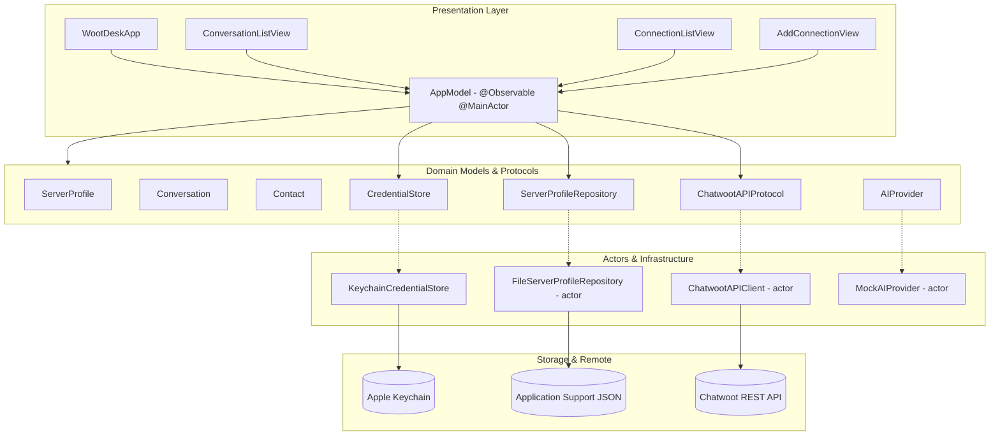

# WootDesk System Architecture

## Architecture Overview

WootDesk is architected as a clean, multiplatform Swift application using modern Apple frameworks (SwiftUI, Observation, Security, and OSLog) targeting macOS 15.0+ and iOS 18.0+.

---

## Key Design Patterns & Boundaries

### 1. State Management & Modern Observation
- **Root State (`AppModel`):** Manages top-level application state, active profile selection, and credential restoration on `@MainActor`.
- **Feature State (`ConversationListState`, `ConnectionViewState`):** Manages local screen state, search query filtering, and transient validation lifecycles.
- **Dependency Injection:** Shared services are injected into the SwiftUI hierarchy via `AppEnvironment` using SwiftUI environment values.

### 2. DTO & Domain Model Separation
- Transport models (`ChatwootProfileDTO`, `ChatwootConversationDTO`, `ChatwootContactDTO`) decode raw JSON from Chatwoot APIs.
- Tolerant decoders handle differences in self-hosted Chatwoot versions (e.g., nested `data.payload` vs flat `payload` arrays, seconds vs milliseconds timestamps).
- Domain models (`ServerProfile`, `Conversation`, `Contact`) are `Sendable` value types and remain independent of transport quirks. `ServerProfile` has mutable non-secret metadata so a validated profile can be updated while retaining its stable UUID.

### 3. Secure Persistence
- **Keychain (`KeychainCredentialStore`):** Stores personal access tokens as generic password items keyed by profile `UUID`. iOS and release builds use `kSecAttrAccessibleAfterFirstUnlockThisDeviceOnly`. Ad-hoc macOS Debug builds without an authorised application identifier use the default local Keychain, because the data-protection Keychain rejects those builds with `errSecMissingEntitlement`.
- **Profile Metadata (`FileServerProfileRepository`):** Stores non-secret server URLs, account names, and timestamps in an atomically written JSON file within `Application Support/WootDesk/`. Corrupted files are backed up automatically rather than causing app crashes.

### 4. Networking & Concurrency
- `ChatwootAPIClient` is actor-backed, preventing data races.
- Structured concurrency (`async/await`, `Task`) provides automatic request cancellation.
- Requests pass through `APIRequest` to normalise URLs, enforce HTTPS, and attach `api_access_token` and `Accept: application/json` headers.
- The same credential is sent as `api-access-token`. Chatwoot reads this wire header through Rack as `HTTP_API_ACCESS_TOKEN`, supporting reverse proxies that reject underscore header names while retaining the documented header.
- Conversation requests always send a `status` query item. `ConversationStatus?.none` means the user selected "All", so the client sends Chatwoot's documented `status=all` value rather than omitting the parameter and falling back to Chatwoot's documented `open` default.
- Conversation paging is a page counter on `ConversationListState`. The next page is requested when the last loaded row appears, and paging stops when a page returns nothing new. A failed page keeps the rows already shown.

### 5. Platform Navigation
- **macOS:** a single three-column `NavigationSplitView` owned by `MainAppView`: sidebar (workspace, server profiles, settings), content (`ConversationListView`), and detail (`ConversationDetailView`). The conversation list state is owned by `MainAppView` so the list and the detail column read the same selection. Split views are never nested.
- **iOS and iPadOS:** a `TabView` of `NavigationStack`s. The conversation list pushes `ConversationDetailView` through `navigationDestination(item:)`, and supports pull-to-refresh.
- `ConversationListView` itself renders list content only, so both shells reuse it without either owning the other's navigation container.

### 6. Testing and Preview Seams
- `StubChatwootAPI` is a `ChatwootAPIProtocol` implementation returning a configured success, failure, or never-returning result. Previews and unit tests use it to reach the genuine loading, empty, error, and loaded states. It is never wired into `AppEnvironment.live()`.
- `InMemoryServerProfileRepository` and `InMemoryCredentialStore` back `AppEnvironment.preview()`, so no test or preview touches the Keychain, Application Support, or the network.
- `MockURLProtocol` covers the real `URLSession` path in the API client tests.
- Launching the app with `--uitesting` selects the in-memory environment, giving the UI tests a deterministic first-run state.

### 7. Distribution and Privacy Metadata

- `project.yml` enables automatic signing for the app target but does not
  commit a personal or organisation `DEVELOPMENT_TEAM` value. CI passes
  signing-disabled overrides, while a release engineer selects the approved
  team locally before archive.
- The macOS Release configuration enables Hardened Runtime and retains the App
  Sandbox with outbound network access only. Separate Developer ID
  notarisation is outside the current Mac App Store path.
- `PrivacyInfo.xcprivacy` declares no tracking, collected-data categories, or
  required-reason API use for the current source. It must be reassessed whenever
  dependencies or platform APIs change.
- The asset catalogue supplies one opaque 1024 pixel iOS and iPadOS master and
  explicit macOS sizes derived from a transparent macOS master.
- One shared bundle identifier prepares the versions for one App Store Connect
  product. Both platform archives need a preflight because current Apple
  documentation is inconsistent about whether macOS must use a separate target.

---

## Chatwoot Compatibility Assumptions

The current official Application API documents `GET /api/v1/profile` and
`GET /api/v1/accounts/{account_id}/conversations`. The conversation endpoint
documents a `data.payload` envelope, paging, and status filters. WootDesk follows
that contract while accepting a small set of response variants seen across
self-hosted versions.

Server errors are tolerated when they use `message`, `error`, or a string
`errors` array. Each known shape is covered by local mocked tests. No automated
test contacts a live Chatwoot server.

Because self-hosted deployments vary, decoding stays deliberately tolerant: the
conversation envelope accepts `data.payload`, a top-level `payload`, or a bare
array, and numeric timestamps are mapped from Unix seconds or milliseconds in a
single tested mapping layer.
A response matching **none** of the known shapes is reported as a decoding
error rather than as an empty list, so a compatibility problem is never
presented to the user as "no conversations".
