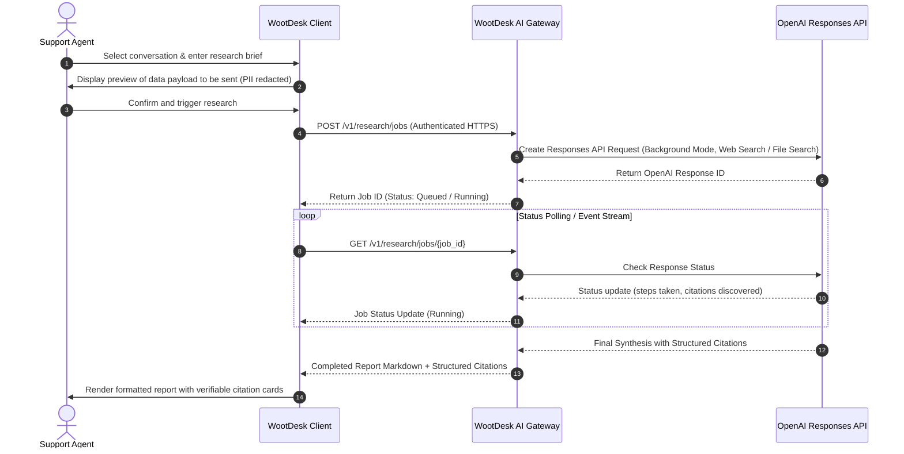

# WootDesk AI Gateway & Deep Research Specification

## Overview & Core Principles

WootDesk is designed to incorporate artificial intelligence capabilities, such as conversation summarisation, intelligent draft replies, and cited deep research, without compromising customer data privacy or application security.

### Core Architecture Rules

1. **No Embedded OpenAI API Keys:**
   The Apple client binary will never contain or request an OpenAI API key. All AI operations are proxied through an authenticated, user-controlled **WootDesk AI Gateway**.
2. **Decoupled Gateway Architecture:**
   The gateway is a lightweight service that can be self-hosted alongside a Chatwoot server or hosted centrally by an organisation.
3. **Model Flexibility:**
   The model is gateway configuration, never a client constant. As of 30 August 2026, the official deep research guide lists `o3-deep-research` and `o4-mini-deep-research`. Those names are a dated capability snapshot, not client defaults. A gateway deployment must re-check the [current deep research guide](https://developers.openai.com/api/docs/guides/deep-research) and configure a currently supported model.

   A deep research request must include at least one supported research data source: web search, file search with a vector store, or an approved remote MCP server. The gateway owns that configuration and its allow-list.
4. **Chatwoot Credential Isolation:**
   Chatwoot access tokens are never transmitted to the AI Gateway.
5. **Explicit User Consent & Redaction by Default:**
   No conversation data is transmitted to the gateway without a deliberate user action. By default, sensitive attributes (internal notes, attachments, customer email, phone numbers, and custom metadata) are redacted unless explicitly included by the user.

---

## Deep Research End-to-End Flow



---

## Gateway API Contract (Draft Specification)

### 1. Create Research Job
- **Path:** `POST /v1/research/jobs`
- **Headers:** `Authorization: Bearer <gateway_token>`
- **Request Body:**
```json
{
  "conversation_id": 5001,
  "brief": "Investigate compatibility of Redis Cluster mode with ActionCable 7.1",
  "context": {
    "public_messages": [
      "Customer reports connection drops when scaling Redis nodes.",
      "Error: MOVED 12182 192.0.2.10:6379"
    ],
    "include_internal_notes": false
  },
  "search_parameters": {
    "max_sources": 5,
    "allowed_domains": ["chatwoot.com", "redis.io", "github.com"]
  }
}
```
- **Response:**
```json
{
  "job_id": "job_8f29ab71e",
  "status": "queued",
  "created_at": "2026-08-30T13:00:00Z"
}
```

### 2. Poll Job Status & Fetch Results
- **Path:** `GET /v1/research/jobs/{job_id}`
- **Response (Completed):**
```json
{
  "job_id": "job_8f29ab71e",
  "status": "completed",
  "completed_at": "2026-08-30T13:02:15Z",
  "result": {
    "report_markdown": "### Resolution\nActionCable standard adapter requires a standalone Redis instance or a cluster-aware proxy...",
    "citations": [
      {
        "id": "cite_1",
        "title": "ActionCable Redis Adapter Configuration",
        "url": "https://guides.rubyonrails.org/action_cable_overview.html",
        "snippet": "The standard redis adapter does not support automatic slot discovery in Redis Cluster without a dedicated proxy.",
        "data_source": "Ruby on Rails Documentation"
      }
    ]
  }
}
```

### 3. Cancel a Research Job
- **Path:** `POST /v1/research/jobs/{job_id}/cancel`
- Cancels the underlying OpenAI response if it is still running, and moves the job to `cancelled`. Cancelling an already terminal job is a no-op and returns the job unchanged.

### 4. Delete a Research Job
- **Path:** `DELETE /v1/research/jobs/{job_id}`
- Purges the stored report, citations, and any retained context immediately, ahead of the normal TTL. Returns `204` whether or not the job still existed, so a client retry is safe.

### Job State Machine

```
queued ──► running ──► completed
   │          │
   │          ├──────► failed
   └──────────┴──────► cancelled
```

`queued`, `running`, `completed`, `failed`, and `cancelled` are the only states.
`completed`, `failed`, and `cancelled` are terminal. The client models these as
`ResearchJobStatus` and must treat any unrecognised value as `failed` rather
than assuming success.

### Error Model

Failures return a stable, non-leaking envelope:

```json
{
  "job_id": "job_8f29ab71e",
  "status": "failed",
  "error": {
    "code": "upstream_timeout",
    "message": "The research run exceeded the configured time limit.",
    "retryable": true
  }
}
```

- `code` is a stable machine-readable identifier: `invalid_request`,
  `unauthorised`, `rate_limited`, `budget_exceeded`, `upstream_timeout`,
  `upstream_error`, `cancelled`, `internal_error`.
- `message` is safe to show a user. It never contains the OpenAI key, the raw
  upstream payload, or a stack trace.
- The gateway maps upstream provider errors onto this set, so a change of model
  or provider does not change the client contract.

### Cost, Timeout, and Usage Limits

The gateway enforces every limit server-side. A client cannot raise them.

| Limit | Purpose | Suggested starting value |
|---|---|---|
| Per-job wall-clock timeout | Bound a runaway background run | 15 minutes, then `failed` with `upstream_timeout` |
| Per-job token ceiling | Bound the cost of a single run | Cap input and output tokens; reject the request when the assembled context exceeds it |
| Per-job cost ceiling | Hard currency cap per run | Refuse to start a job whose projected cost exceeds it |
| Per-user daily job quota | Prevent one agent exhausting the budget | e.g. 20 jobs per user per day |
| Per-organisation monthly spend cap | Protect the operator's bill | Reject with `budget_exceeded` once reached |
| Concurrent jobs per user | Bound parallel spend | e.g. 2 |
| Request body size | Bound context assembly cost | e.g. 256 KB |

Every job records its actual token usage and computed cost so the operator can
report spend per user and per account.

Deep research runs can take several minutes, so the gateway starts the Responses
API request in background mode and polls or subscribes for terminal state. The
official guide notes that background polling data is retained temporarily by
OpenAI. A deployment with strict Zero Data Retention requirements must leave
background mode disabled unless the current OpenAI documentation explicitly
supports its retention policy.

### Gateway Key Handling

The OpenAI API key lives only in the gateway's environment or secret manager. It
is never returned by any endpoint, never logged, and never sent to a client.
Following OpenAI's own API key guidance, the key is issued per deployment,
rotated on a schedule and immediately on suspected exposure, and scoped to the
minimum project required. Client authentication to the gateway uses a separate,
independently revocable credential, so revoking one agent's access never
requires rotating the OpenAI key.

---

## Planned AI Actions

1. **Summarise Conversation:**
   Generates a concise markdown bullet-point summary of long conversation threads for handovers between agents.
2. **Draft Contextual Reply:**
   Produces an empathetic, accurate response based on the conversation context and knowledge base materials.
3. **Improve Tone & Clarity:**
   Rewrites an agent's drafted message to ensure professional, clear, and reassuring tone.
4. **Translate Message:**
   Translates foreign language customer inquiries into the agent's preferred language, and translates drafts back into the customer's language.
5. **Extract Action Items:**
   Identifies tasks, follow-up promises, and scheduled commitments from the message stream.
6. **Deep Cited Research:**
   Initiates multi-step background research using the OpenAI Responses API, returning verifiable source citations.

---

## Privacy, Retention & Compliance Controls

### Consent

- No conversation content leaves the user's Chatwoot server without a deliberate action for that specific conversation. There is no background, automatic, or opportunistic AI call.
- Before the request is sent, the app shows exactly what will leave the server: the rendered brief, the precise message list, and every field included.
- Consent is per job. It is never remembered as a global preference, and never implied by a previous job on the same conversation.
- The consent decision is recorded locally with the job so a user can see afterwards what they agreed to send.

### Redaction Defaults

`AIContextScope.safeDefault` sends public messages only. Each of the following
is excluded unless the user explicitly opts in for that job:

| Excluded by default | Opt-in flag |
|---|---|
| Internal agent notes | `includeInternalNotes` |
| Customer email and phone number | `includeContactDetails` |
| Custom attributes | `includeCustomAttributes` |
| Customer name | `includeCustomerName` |
| Attachments and file contents | Not supported in this design |

Redaction is applied client-side, before transmission, so excluded data never
reaches the gateway at all rather than relying on the gateway to discard it.

### Retention and Deletion

- Job results are stored with a short TTL (for example one hour) and purged automatically.
- `DELETE /v1/research/jobs/{job_id}` purges a job immediately on request.
- Assembled conversation context is held only for the lifetime of the job and is never persisted beyond it.
- The gateway keeps no long-term copy of customer message content.

### Audit Logging

- The gateway logs job identifiers, the authenticated principal, timestamps, state transitions, token usage, and computed cost.
- It never logs message bodies, briefs, report text, the OpenAI key, or the client credential.
- Audit records are retained independently of job results so that spend and access remain auditable after content is purged.

### Data Minimisation

- The client assembles the smallest context that answers the brief and strips metadata the model does not need.
- Chatwoot access tokens are never sent to the gateway under any configuration.
